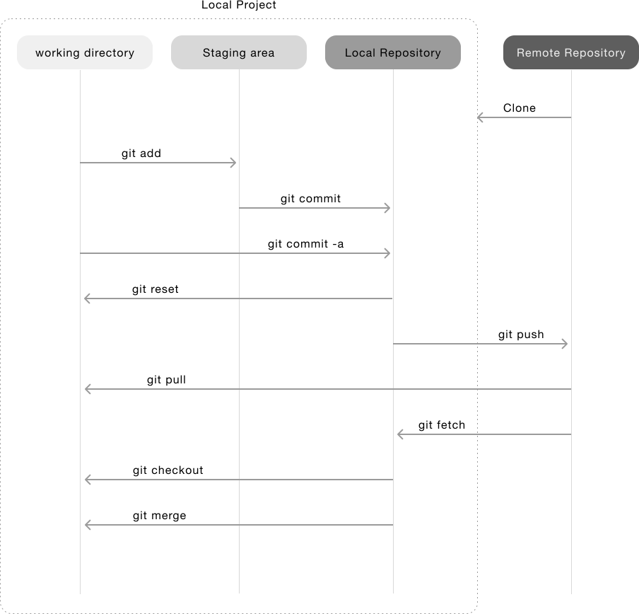

# Simple git commands for zsh -- this is a setup for a iMac

This `git` plugin is a small list of aliases that will be use within the plugin system of `zsh`.



```bash

# git commamands simplified
alias gst='git status'

alias gci='git commit'
# it shows the diff on the editor before adding comments (-v verbose and -a stage)
alias gca='git commit -v -a'

alias gb='git branch'
# List branch in the remote repository
alias gbr='git branch --remote'
# adds all files or directories to staging area
alias gad='git add -A'
alias gpl='git pull'
alias gpu='git push'

# Checkout
alias gco='git checkout'
# Creates a new branch
alias gcob='git checkout -b'
# Checkout master
alias gcm='git checkout master'
# Checkout develop
alias gcd='git checkout develop'

# Fetch
alias gf='git fetch'
# Before fetching, remove any remote-tracking references that no longer exist on the remote
alias gfa='git fetch --all --prune'
# Fetch all branches that exist in the origin 
alias gfo='git fetch origin'

# Logging
alias glg='git log --date-order --all --graph --format="%C(green)%h%Creset %C(yellow)%an%Creset %C(blue bold)%ar%Creset %C(red bold)%d%Creset%s"'
alias glg2='git log --date-order --all --graph --name-status --format="%C(green)%H%Creset %C(yellow)%an%Creset %C(blue bold)%ar%Creset %C(red bold)%d%Creset%s"'

```

## Adding syntax highlight

1) you need to install syntax [zsh-syntax-highlighting](https://github.com/zsh-users/zsh-syntax-highlighting) for Zsh. 

`brew install zsh-syntax-highlighting`

2) Then active it within your `.zshrc` file -- this have to be place at the end of the file.

```bash
# Active zsh-syntax-highlighting.
# reference: https://github.com/zsh-users/zsh-syntax-highlighting/blob/master/INSTALL.md
source /usr/local/share/zsh-syntax-highlighting/zsh-syntax-highlighting.zsh
```